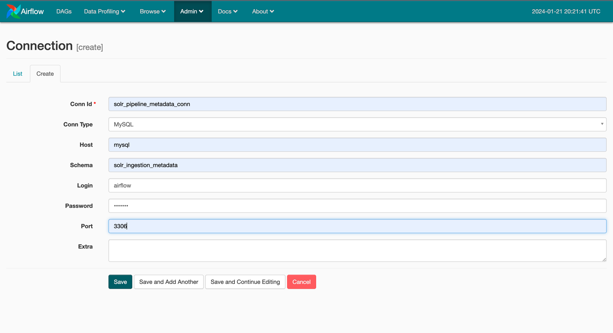

# Solr Ingestion Pipeline

## Overview

The Solr Ingestion Pipeline is an Airflow-based data ingestion solution that automates the process of loading data 
into a Solr collection from files hosted on Google Drive and sending an email notification on completion. It consists 
of a main DAG (`solr_ingestion_pipeline`) and a sub-DAG (`entity_ingestion`) for handling entity-specific data ingestion.

## Project Structure

- **docker/**: Has the docker files and related scripts required for setup of Airflow and python libraries.
- **dump/**: Has the (`create_initial_tables.sql`) script for setting up the mysql metadata database for the loads and entities.
- **mnt/airflow/dags/**: Contains the main DAG script (`solr_ingestion_pipeline.py`)
- **mnt/airflow/entity_ingestion/**: Contains the sub-DAG factory script (`entity_ingestion_sub_dag.py`).
- **mnt/scripts/**: Holds the ETL (Extract, Transform, Load) script (`etl.py`) used for data ingestion.
 

## Requirements

The following software is required for the complete workflow (from git clone to the running Docker Container). 
The specified versions are the tested ones. Other versions should also work.

 * Git 2.39.3
 * Docker 24.0.7

## Installation and Setup

1. Clone the repository:

   ```bash
   git clone https://github.com/rghoshal18/solr_ingestion_pipeline.git
   cd solr_ingestion_pipeline

2. Create the .env file with the following parameters. This would be used for setting up env variables for the services.
   
   ```.env
   FERNET_KEY=46BKJoQYlPPOexq0OhDZnIlNepKFf87WFwLbfzqDDho=
   EXECUTOR=Celery
   POSTGRES_USER=airflow
   POSTGRES_PASSWORD=airflow
   POSTGRES_DB=airflow
   REDIS_PASSWORD=airflow
   MYSQL_ROOT_PASSWORD=airflow
   MYSQL_DATABASE=solr_ingestion_metadata
   MYSQL_USER=airflow
   MYSQL_PASSWORD=airflow
   AIRFLOW__SMTP__SMTP_HOST=smtp.gmail.com
   AIRFLOW__SMTP__SMTP_STARTTLS=True
   AIRFLOW__SMTP__SMTP_SSL=False
   AIRFLOW__SMTP__SMTP_USER=airflow@gmail.com
   AIRFLOW__SMTP__SMTP_PASSWORD=airflow
   AIRFLOW__SMTP__SMTP_PORT=587
   AIRFLOW__SMTP__SMTP_MAIL_FROM=airflow_trigger@gmail.com
   ```

3. Start the application:

   ```bash
   number_of_workers=4
   sh start.sh ${number_of_workers}
   ```
   This should start all the required services for the airflow. 
   The first installation would take some time.

4. Creating the mysql connection:

   Go to the Airflow UI: localhost:8080.
   Go to Admin -> Connections -> Create

   

5. Stop the application:

   ```bash
   sh stop.sh
   ```
   
6. Restart the application
   ```bash
   number_of_workers=4
   sh restart.sh ${number_of_workers}
   ```
   Note: Everytime you restart your application, you would need to setup mysql connection on Airflow Admin Page.